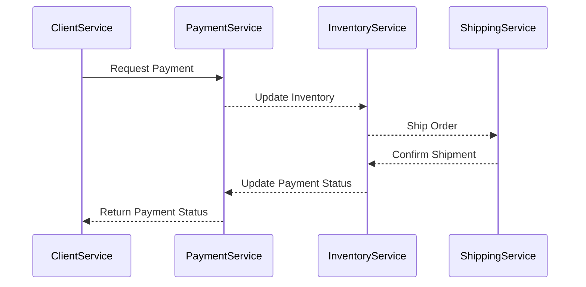

import PortTooltip from "/src/components/tooltip/tooltip.jsx"

# Markdown

Markdown "属性用于在 Port<PortTooltip id="entity">实体</PortTooltip>中显示[Markdown](https://en.wikipedia.org/wiki/Markdown) 内容。使用该属性将自动在每个[entity page](/customize-pages-dashboards-and-plugins/page/entity-page.md) 中创建一个额外的选项卡，显示格式化的内容。

在下面的示例中，我们看到了 `awesome-kubectl-plugins` 实体页面，它是 `Service` 蓝图上的一个实例。 该蓝图有一个 `Markdown` 属性，可从服务的 Git 代码库中获取 Readme 文件，并自动将其显示在专用标签页中: 


通过 Port，您可以导入[Markdown](https://en.wikipedia.org/wiki/Markdown) 文件并将其显示为标签页。

## 💡 常见嵌入式 URL Usage

* 显示服务的自述文件
* 显示服务/ packages 的相关文件

## 模式定义

```json showLineNumbers
{
  "title": "Markdown Property",
  "type": "string",
  "format": "markdown",
  "description": "A Markdown property"
}
```

## Mermaid

markdown widget 还支持[Mermaid](https://mermaid-js.github.io/mermaid/#/) ，这是一款图表制作工具，可使用文本和代码生成图表。

要将 Mermaid 与 markdown widget 结合使用，只需在 markdown 属性中添加 mermaid 语法即可。更多使用示例和信息可参考[Mermaid Examples](https://mermaid.js.org/syntax/examples.html) 。


<details>
<summary><b>Mermaid diagram example (click to expand)</b></summary>



</details>
